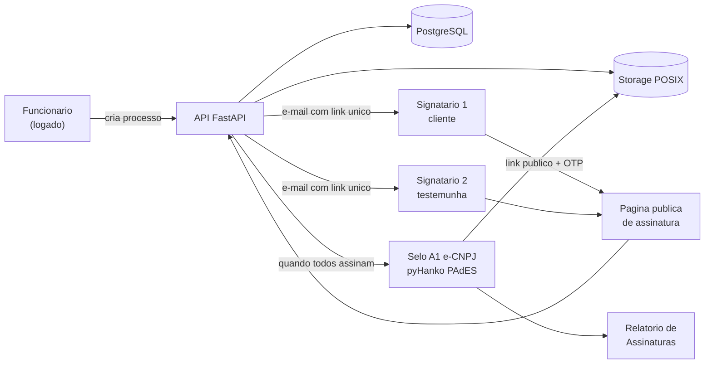
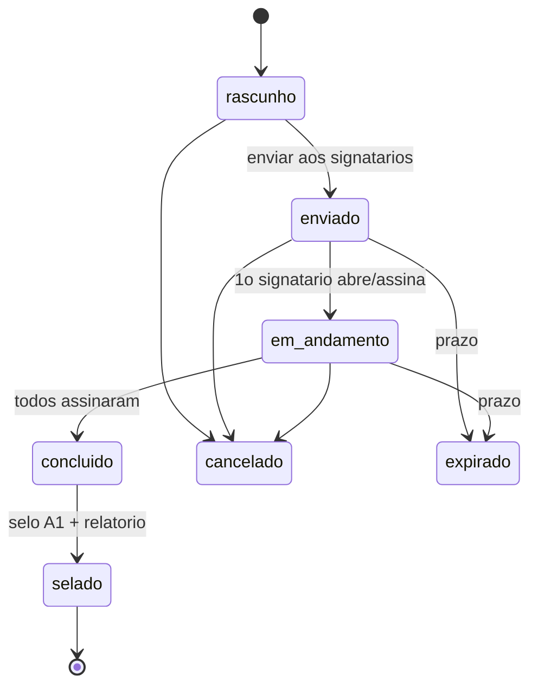
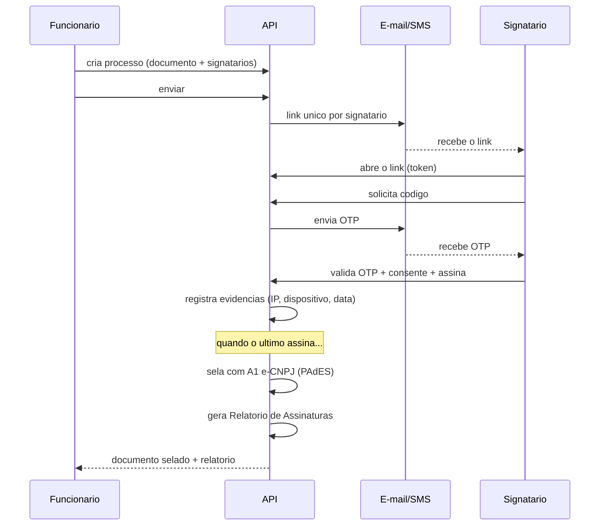
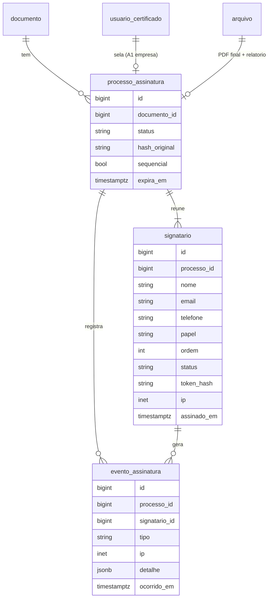

# Assinatura Multipartes — Substituição do ZapSign (proposta de desenho)

> **Desenho a construir** (ainda não implementado). Objetivo: substituir o ZapSign por um módulo
> próprio de **assinatura eletrônica avançada multipartes** com validade legal (MP 2.200-2/2001,
> Lei 14.063/2020). Decisões já tomadas: OTP por **e-mail agora** (SMS depois) · selo final com o
> **A1 e-CNPJ da empresa**. Data: 2026-09-24.

Escrito para: você (visão do produto) e quem for implementar.

---

## 1. A ideia em uma frase

O funcionário cria um **processo de assinatura** para um documento, adiciona os **signatários**
(cliente, empresa, testemunha), o sistema envia a cada um um **link único** por e-mail; cada
signatário **se autentica por código (OTP)** e assina; quando todos assinam, o sistema **sela** o PDF
com o **certificado A1 da empresa** e gera o **Relatório de Assinaturas** (evidências).

## 2. Arquitetura — onde encaixa

**Ponto-chave:** os signatários **não são usuários do sistema** (são clientes/testemunhas). Eles
acessam por uma **página pública** via link com token, sem login — a identidade é provada pelo OTP.

## 3. Ciclo de vida do processo

Estados de cada **signatário**: `pendente → enviado → visualizado → assinado` (ou `recusado`).

## 4. Fluxo de assinatura (passo a passo)

## 5. Modelo de dados (novo)

- **`processo_assinatura`** — um processo por documento (título, status, hash, prazo, `sequencial`
  = exige ordem?, certificado do selo, arquivo final e relatório).
- **`signatario`** — cada parte (nome, e-mail, telefone, **papel**: parte/testemunha/aprovador,
  **ordem**, status, **token do link**, evidências: ip/dispositivo/data).
- **`evento_assinatura`** — trilha imutável de evidências (criado, enviado, link aberto, OTP enviado,
  OTP validado, assinado, recusado, selado) — é a base do **Relatório de Assinaturas**.
- **Reaproveita**: `documento`, `arquivo` (papel `assinado`/novo `relatorio`), `usuario_certificado`
  (o A1 da empresa), e a infra de **OTP** (hoje por e-mail).

## 6. Endpoints propostos

**Do funcionário (logado):**

| Método | Rota | Ação |
|--------|------|------|
| POST | `/assinatura-processos` | Cria processo (documento + signatários + prazo + sequencial) |
| POST | `/assinatura-processos/{id}/enviar` | Dispara os e-mails com os links |
| GET | `/assinatura-processos/{id}` | Status + signatários + eventos |
| POST | `/assinatura-processos/{id}/cancelar` | Cancela |

**Público (sem login, por token do link):**

| Método | Rota | Ação |
|--------|------|------|
| GET | `/assinar/{token}` | Dados do documento/processo para o signatário |
| POST | `/assinar/{token}/solicitar-codigo` | Envia OTP (e-mail; SMS depois) |
| POST | `/assinar/{token}/confirmar` | Valida OTP + consentimento + **assina** (captura evidências) |
| POST | `/assinar/{token}/recusar` | Recusa com motivo |

Ao concluir, o sistema **sela** e gera o **relatório** (interno). Download pelo já existente
`GET /documentos/{id}/assinado`; o selo **"X assinaturas"** aparece nas consultas.

## 7. Segurança e validade legal

- **Link com token** aleatório e imprevisível por signatário; expira com o processo.
- **OTP por signatário** (e-mail; SMS depois), com expiração e limite de tentativas — reaproveita a
  infra de 2FA.
- **Evidências** por assinatura: IP, user-agent, data/hora, meio de autenticação — em
  `evento_assinatura` (imutável) → base do Relatório.
- **Integridade**: hash SHA-256 do documento; **selo final PAdES com o A1 e-CNPJ da empresa**
  (equivalente ao selo da plataforma no ZapSign) → "INTEGRIDADE CERTIFICADA – ICP-BRASIL".
- **Padrão legal**: assinatura **avançada** (Lei 14.063/2020) — o mesmo nível que vocês usam hoje no
  ZapSign. (Qualificada exigiria certificado próprio de cada signatário.)

## 8. Plano de construção (fases)

| Fase | Entrega |
|------|---------|
| 1 | Modelo + migration (`processo_assinatura`, `signatario`, `evento_assinatura`) |
| 2 | Criar processo + enviar e-mails (funcionário) |
| 3 | Página/endpoints **públicos** de assinatura (token + OTP + consentimento + evidências) |
| 4 | **Selo A1 e-CNPJ** + geração do **Relatório de Assinaturas** (pyHanko + reportlab) |
| 5 | Consulta de estado + selo "X assinaturas" + download |
| 6 | (Depois) SMS; e opcional carimbo do tempo / PAdES-LTA |

Cada fase entra com **testes ponta a ponta** rodando de verdade, como fizemos até aqui.

## 9. O que preciso de você para o selo (Fase 4)
- O **certificado A1 e-CNPJ** do Parque Bonfim (`.pfx` + senha) para selar os documentos — pode ser
  cadastrado depois, cifrado, como já fazemos com os certificados de usuário.
